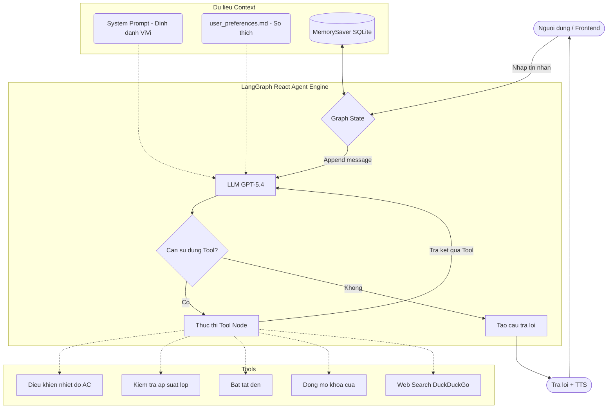

# Sơ đồ Hoạt động (Workflow) của VinFast AI Agent

Dưới đây là sơ đồ chi tiết kiến trúc hoạt động của `agent.py` được xây dựng dựa trên cốt lõi **LangGraph React Agent**.

## Chú thích luồng hoạt động:

1. **Truyền Ngữ cảnh**: Trước khi bắt đầu, LLM (gpt-5.4) sẽ đọc song hành `System Prompt` (bao gồm các quy tắc ứng xử bắt buộc) và trích xuất thông tin cá nhân từ `user_preferences.md` (giúp AI hiểu sở thích nghe nhạc lofi, gọi tên Hùng, bật điều hoà 22 độ, v.v).
2. **Khởi tạo và Ghi nhớ**: Dữ liệu tin nhắn mới của người dùng đi vào hệ thống qua Graph, nó sẽ được checkpointer (`MemorySaver`) gắn với một Thread ID cục bộ để giữ ngữ cảnh xuyên suốt cuộc trò chuyện.
3. **LLM Quyết định (Routing)**: Mô hình GPT đọc thông tin. Nếu nhận diện được tác vụ cần can thiệp vật lý vào xe (ví dụ: "Bật điều hoà") hoặc thiếu kiến thức (ví dụ: "Thời tiết hôm nay"), nó sẽ không trả lời ngay mà tạo ra yêu cầu gọi Tool.
4. **Vòng lặp Tools**: Yêu cầu gọi Tool đi đến `Tool_Node`. Tool thực thi lệnh trong hệ thống Singleton `car_state.py` hoặc fetch API từ Web. Sau đó thu thập kết quả và trả về cho LLM. Vòng lặp này có thể lặp nhiều lần cho đến khi kết thúc mọi yêu cầu đa nhiệm.
5. **Đầu ra**: Nếu không cần dùng Tool nữa, `Condition` sẽ dẫn đến trạng thái xuất kết quả. Frontend nhận dạng câu trả lời và tự động kích hoạt tính năng SpeechSynthesis đọc lên thành giọng nói.
